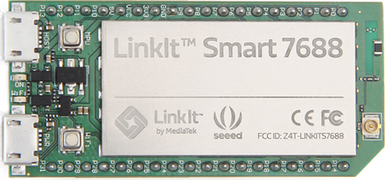

# LinkIt Smart

[](https://travis-ci.org/nerves-project/nerves_system_linkit)

This is the base Nerves System configuration for the [LinkIt Smart](http://www.seeedstudio.com/wiki/LinkIt_Smart_7688_Duo).



| Feature              | Description                     |
| -------------------- | ------------------------------- |
| CPU                  | 580 MHz MIPS24KEc               |
| Memory               | 128 MB DRAM                     |
| Storage              | 32 MB NAND Flash and MicroSD    |
| Linux kernel         | 4.4.14 w/ OpenWRT patches       |
| IEx terminal         | ttyS2 via FTDI pins             |
| GPIO, I2C, SPI       | Yes - Elixir ALE                |
| ADC                  | Yes, on Duo's ATmega32U4        |
| PWM                  | Yes, on Duo's ATmega32U4        |
| UART                 | 3?                              |
| Camera               | None                            |
| Ethernet             | Yes, via expansion board        |
| WiFi                 | Yes                             |

## Console access

The console is configured to output to `ttyS2` by default. This is
accessible via pins 8 (RX) and 9 (TX). A 3.3V FTDI
cable is needed to access the output. The UART should be configured
to 57600 8n1.

## Prepping the LinkIt Smart

Before you can use a LinkIt Smart with Nerves, you must update the bootloader.
Follow these instructions precisely and patiently so that you don't accidentally
brick your board. If something goes wrong, the board will not boot. You will
need a SPI NAND Flash programmer to fix it, and given the cost of the board, it
probably is easier to just buy a new LinkIt Smart.

You'll need a normal USB flash drive and an On-the-go cable to plug it into the
USB port on the LinkIt Smart. The USB flash drive should have a FAT filesystem
on it. If you're not sure, you probably are ok.

Download the Nerves LinkIt Smart bootloader and Linux kernel images and place
them in the root directory of the USB flash drive. They should be named
`lks7688.ldr` and `lks7688.img`. They're include in the system image, but you
can get them on the GitHub release page too.

Then do the following:

  1. Connect a 3.3V FTDI cable (GND, RX, and TX) to the LinkIt Smart. Power up
     the LinkIt Smart and verify that you can see text and type. You should be
     interacting with the default OpenWRT firmware.
  2. Remove power from the LinkIt Smart
  3. Plug the USB Flash drive into the LinkIt Smart via the On-the-go cable.
     Make sure that it's plugged into the `USB Host` connector.
  4. Apply power to the LinkIt Smart and get ready for the next step
  5. Press the 'b' key repeatedly on the serial port until you see that it
     is programming the Flash.
  6. When the programming completes, the LinkIt Smart will reboot. You'll still
     get prints OpenWRT.
  7. Now reboot (remove/apply power) or press the `MPU` reset button.
  8. Press the '5' key repeatedly on the serial port until you see that it is
     programming the Flash.

Now you're done. The next reboot will load Nerves. Keep in mind that Nerves
requires an SDCard with the root filesystem on it to work. This isn't necessary
for production, but it's much and convenient during development. If you don't
have an SDCard image yet, go through the normal Nerves workflow and `mix burn`
yourself one. Insert it and reboot and you should have an `iex` prompt.

## The bootloader

The LinkIt Smart bootloader is a very customized old version of u-boot. If
you're familiar with u-boot, forget what you know.

To break into the bootloader, press the `4` key continuously on a reboot.

To load an image over TFTP, press the `1` key continuously on reboot until you
get a prompt. If you stare hard at the messages, you can see what to type. Keep
in mind that the rootfs is still on the NAND Flash.

## Rebuilding

This system is built similar to other Nerves systems. The bootloader has one
additional dependency:
```
sudo apt-get install libc6:i386
```

## Going back to OpenWRT

MediaTek and Seeedstudio provide some information about the board that also
applies to Nerves. If you decide to switch back to OpenWRT, see the following
links:

http://support.seeedstudio.com/knowledgebase/articles/848667-linkit-smart-7688-duo-sku-102110017
https://labs.mediatek.com/site/global/developer_tools/mediatek_linkit_smart_7688/training_docs/firmware_and_bootloader/kernel_console/index.gsp

You will need to update both the bootloader and the firmware.

## Firmware updates

Due to the kernel and rootfs being split across the onboard NAND and the SDCard,
the firmware update process is less than ideal. Currently only the rootfs gets
updated if you're using the normal Nerves `fwup` proceedures. To update the
kernel, you must to it manually. The kernel is included in the rootfs in the
`/boot` directory. After updating the rootfs, you can run:
```
iex> :os.cmd 'dd if=/boot/uImage of=/dev/mtdblock3 bs=1M'
```

If you'd like to automate this more, update the `fwup.conf` file to include
the kernel. You'll see comments about this. We used to do this, but then
found it less tedious to do the above. In a production system, this issue
should be fixed. Ideally, the rootfs would be on the NAND as well.

## Installation

If [available in Hex](https://hex.pm/docs/publish), the package can be installed as:

  1. Add nerves_system_linkit to your list of dependencies in `mix.exs`:

        def deps do
          [{:nerves_system_linkit, "~> 0.11.0"}]
        end
        
  2. Ensure nerves_system_linkit is started before your application:

        def application do
          [applications: [:nerves_system_linkit]]
        end

## Linux and OpenWRT patches

The official defconfig and kernel patches for the MT7688 on the LinkIt Smart
are found in the OpenWRT repository. See https://dev.openwrt.org/wiki/GetSource.

This repository uses the OpenWRT Linux 4.4 patch set. They can be found in the
following directories:

https://github.com/openwrt/openwrt/tree/master/target/linux/generic
https://github.com/openwrt/openwrt/tree/master/target/linux/ramips/patches-4.4

## Wifi setup

In order to use the wifi device, the mt7603e kernel module needs to be loaded,
by doing for example
```
    System.cmd("modprobe", ["mt7603e"])
```
